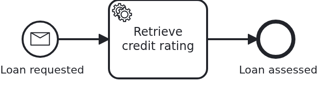

# Starting a workflow by message

[](./LICENSE)

Some processes are modelled to begin with a message rather than with somebody pressing a
button: an order arrives, a file is delivered, another system reports something. This
blueprint shows what that changes for the application, which is one method name and one
thing to understand about what travels.

## What this blueprint shows



The loan approval of the base blueprint, but its start event is a **message start event**.
Instead of `startWorkflow` the application calls

```java
processService.startWorkflowByMessage(loanApproval, "LoanRequested");
```

and that is the whole difference in code. What is worth understanding:

- **The aggregate comes first.** The application creates it, gives it its natural id and
  persists it - VanillaBP starts the workflow in the same transaction, so a workflow without
  its aggregate cannot happen here either. A message start event does not mean the process
  invents the business case; it means the process is addressed by a message.
- **Only the id travels.** As with every message in VanillaBP, no payload reaches the BPMS:
  the message carries the name it is published under and the aggregate's id, which is how
  the workflow is addressed from then on. Everything the process may need belongs onto the
  aggregate before the call.
- **The model decides, not the code.** Whether a process starts by message is a modelling
  decision, and the application follows it. Using `startWorkflow` on a process modelled this
  way is what VanillaBP would have to reject, and the other way round.

When to model it: a process that is triggered by something arriving rather than by your own
application usually reads better as a message start event, and it composes with
`bpmn-message-correlation` - the same message name may start a workflow and, later, be
correlated with a running one.

## Delta to the base blueprint

Compared to [`module-single`](https://github.com/vanillabp-blueprints/module-single-quarkus):

|         File         |                                    What is different                                     |
|----------------------|------------------------------------------------------------------------------------------|
| `loan_approval.bpmn` | the start event carries a `bpmn:messageEventDefinition`, plus the `bpmn:message`         |
| `Workflow.java`      | `startWorkflowByMessage` instead of `startWorkflow`, with the message name as a constant |

Nothing else changes: the aggregate, the service, the task handler and the API are those of
the base blueprint. That is the point worth taking away - a message start event is a
modelling decision, not an architecture.

## Running it

Requires a JDK 21. Camunda 7 is embedded, so nothing else has to run:

```bash
mvn install verify
```

Running it on another BPMS is a Maven profile, not one line of Java changes:

```bash
mvn install verify -Pcamunda8
```

Camunda 8 is a remote engine, so a cluster has to run. Start one; its address, and everything
else specific to that engine, lives in its profile file
`application/src/main/resources/application-camunda8.yaml`, with a copy for the module's own
test:

```yaml
vanillabp:
  adapters:
    camunda8:
      # Camunda 8 is a remote engine: point this at your cluster.
      rest-address: http://localhost:8080
```

That file is loaded because the Maven profile `camunda8` makes the config profile of the same
name the parent of whichever profile the application runs in, so the engine is chosen once, on
the Maven command line, and the build, the tests and `quarkus:dev` all follow it.

Take the address out and the application does not boot, and says so:

```
Camunda 8 adapter 'camunda8' is used but not configured: the property
'vanillabp.adapters.camunda8.rest-address' is missing.
```

That is the normal way to work with VanillaBP: configuration is validated while booting, and
the message names what to do.

Start the application:

```bash
mvn -pl application quarkus:dev
```

Booting logs a warning per workflow module, and it is meant to be read rather than filtered
away. Both Camunda adapters start out with `name-clash-avoidance: none`, so the identifiers
of this module reach the engine as they are, and the adapter names what it could do instead
and asks for a decision. With one workflow module nothing can collide, which is why this
blueprint leaves the setting alone and keeps its configuration free of `vanillabp.*`. An
application that wants the question answered answers it once:

```yaml
vanillabp:
  adapters:
    camunda7:
      accept-unscoped-identifiers: true
```

That is a promise that the identifiers are unique across all workflow modules, and it turns
the warning into a debug line. Which modes a BPMS offers, and why switching the mode later is
a migration rather than a configuration change, is in
[the wiki](https://github.com/vanillabp/adapter-platform-integration/wiki/Workflow-modules#how-name-clashes-are-avoided).

Start a loan approval. This is the only URL you need:

```
http://localhost:8080/api/loan-approval/start?amount=5000
```

The log names the message the workflow was started with:

```
Loan approval '0f7c…' started by publishing the message 'LoanRequested'
Credit rating of loan approval '0f7c…' is 50
Show the result -> http://localhost:8080/api/loan-approval/0f7c…
```

Opening that URL shows the aggregate, including the credit rating the service task wrote.

## How it works

|                                          File                                          |                                                        Role                                                         |
|----------------------------------------------------------------------------------------|---------------------------------------------------------------------------------------------------------------------|
| `loan-approval/src/main/resources/META-INF/workflow-module`                            | contains `loan-approval` and thereby declares this JAR to be a workflow module                                      |
| `loan-approval/src/main/resources/loan-approval/processes/camunda7/loan_approval.bpmn` | the process: start event, service task, end event. The task names the method implementing it                        |
| `.../loanapproval/model/Aggregate.java`                                                | the workflow aggregate, a normal JPA entity keyed by the loan request ID                                            |
| `.../loanapproval/Service.java`                                                        | the business code: builds the aggregate and tells `Workflow` that a loan was requested                              |
| `.../loanapproval/Workflow.java`                                                       | what the application tells the process; the only class using `ProcessService`                                       |
| `.../loanapproval/WorkflowTaskHandler.java`                                            | what the process tells the application: `@WorkflowService`, `@WorkflowTask`, calls `Service`                        |
| `.../loanapproval/ApiController.java`                                                  | the GET endpoints operating the process                                                                             |
| `.../loanapproval/config/LoanApprovalProperties.java`                                  | the module's own configuration                                                                                      |
| `loan-approval/src/test/.../LoanApprovalIT.java`                                       | starts a real workflow and waits for the aggregate to have been filled                                              |
| `loan-approval/src/test/.../WorkflowModuleTest.java`                                   | the base class it inherits from: booting the module and waiting for workflow progress, identical in every blueprint |
| `application/src/test/.../ApplicationSmokeTest.java`                                   | boots the application, which is where VanillaBP validates that every BPMN task is wired to code                     |

The order of events: `ApiController` calls `Service#initiateLoanApproval`, which builds the
aggregate and tells `Workflow` what happened, namely `loanRequested`, not "start the
process". `Workflow#loanRequested` publishes the message, and VanillaBP persists the
aggregate and starts the workflow in the same transaction, so an aggregate without a
workflow, or the other way round, cannot happen. The BPMS then reaches the service
task and calls `WorkflowTaskHandler#retrieveCreditRating`, which does nothing but hand over
to `Service#assessCreditRating`, with the aggregate loaded before and saved after the call.
That happens in a transaction VanillaBP owns, which is why neither of the two classes
declares one of its own. Only the method the API calls does, since starting a workflow has
to run in a transaction. Putting `@Transactional` on a task handler anyway fails the boot
with a message naming the method, and putting it on a bean the handler calls fails the task
while it runs, so this is a rule VanillaBP enforces rather than one to remember.

That the test waits instead of asserting immediately is not accidental: a BPMS runs tasks in
its own transactions, and a remote one does so eventually. A test assuming otherwise passes
on one engine and fails on the next.

## Documentation

- [Starting a workflow by message](https://github.com/vanillabp/adapter-platform-integration/wiki/Message-correlation#starting-a-workflow-by-message): what the call does and what it sends
- [Message correlation](https://github.com/vanillabp/adapter-platform-integration/wiki/Message-correlation): the same rules for a message reaching a RUNNING workflow
- [Defining a workflow module](https://github.com/vanillabp/adapter-platform-integration/wiki/Workflow-modules-in-Quarkus#defining-a-workflow-module): the marker file, resource conventions and the module's own configuration files
- [How name clashes are avoided](https://github.com/vanillabp/adapter-platform-integration/wiki/Workflow-modules#how-name-clashes-are-avoided): what the warning at startup is about, and the modes keeping two workflow modules apart
- [Workflow aggregates](https://github.com/vanillabp/adapter-platform-integration/wiki/Workflow-aggregates): why there are no process variables
- [Wire up a process / Wire up a task](https://github.com/vanillabp/spi-for-java#usage): the annotations used in `WorkflowTaskHandler.java`
- the wiki of the [BPMS adapter](https://github.com/vanillabp/adapter-platform-integration/wiki/BPMS-adapters) you use: how a BPMN task has to be modelled for that engine

This blueprint is developed in the monorepo
[`blueprints`](https://github.com/vanillabp-blueprints/blueprints). This repository is a
read-only mirror, **issues and pull requests belong there.**

## Noteworthy & Contributors

[VanillaBP](https://www.github.com/vanillabp/spi-for-java) was developed by [Phactum](https://www.phactum.at) with the
intention of giving back to the community as it has benefited the community in the past.


## License

Copyright 2026 Phactum Softwareentwicklung GmbH

Licensed under the Apache License, Version 2.0
